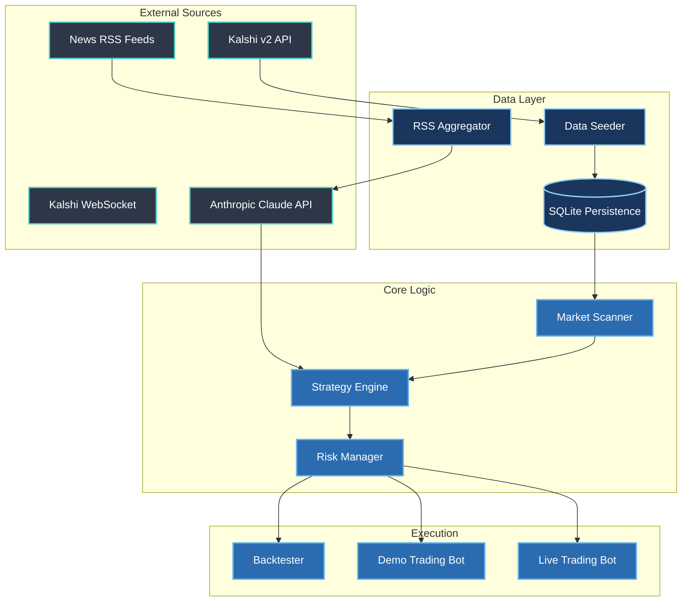

<div align="center">

# ⚡ PolyEdge v5
### Autonomous Prediction Market Trading Bot for Kalshi

[](https://github.com/PolyEdge)
[](https://github.com/PolyEdge)
[](https://kalshi.com/)
[](https://anthropic.com)
[](#)

<br/>


<br/>

*PolyEdge v5 is a ground-up rebuild targeting Kalshi — the only CFTC-regulated prediction market exchange legal for US residents. It uses Claude-powered deep analysis to identify mispricings, fade overreactions to news, and exploit base-rate probability divergences.*

</div>

---

## 🌟 Why Kalshi over Polymarket?

> [!TIP]
> Kalshi provides a vastly superior legal and technical trading environment for US-based traders.

* 🗽 **US-legal:** Fully CFTC-regulated (Polymarket blocks US users from the trading API).
* 💵 **USD Settlement:** Direct ACH transfers (No crypto, no gas fees, no wallet complexity).
* 🛡️ **Zero Shutdown Risk:** Funds are protected with segregation requirements.
* 🤖 **Built for Bots:** Built-in demo environment, unified REST + WebSocket API, and explicit bot support.

## 🧠 Core Thesis: The Speed Defect & Analytical Depth

Event contracts on Kalshi are often priced by a mix of highly reactive retail traders and early-stage momentum bots. 
**When a headline drops, reactive traders overweight the news and underweight historical base rates.**

PolyEdge synthesizes multiple structural signals through **Anthropic's Claude API** to identify exactly when market prices diverge from statistical fair value, executing trades directly into the mispricing.

---

## ⚙️ Strategy Engine

PolyEdge executes a dual-strategy framework tailored structurally to Kalshi's Maker/Taker tiered fees.

### 🎯 Strategy A: Probability Model Arbitrage (Primary)
Compares our own base-rate probability models to the current Kalshi market price.
- **Signal:** Model calculates `68%` probability → Market trades at `52¢` → **BUY YES @ 52¢**.
- **Edge Filter:** Divergence must exceed **10 percentage points** _and_ cover round-trip Maker fee drags.
- **Execution:** Uses `LIMIT` orders to secure Kalshi's `1.75%` Maker rate instead of the `7%` Taker rate.

### 📉 Strategy B: Post-Spike Mean Reversion (Reactive)
Fades rapid, unjustified price moves on the market.
- **Signal:** Market skyrockets from `50¢` to `85¢` on news that Claude classifies as "zero regulatory substance" → **FADE (BUY NO)**.
- **Filter:** Always waits 30-60 minutes for extreme volatility to settle before executing.

---

## 📐 Architecture Diagram



---

## 📊 Risk Management Framework

> [!CAUTION]
> PolyEdge employs hard-coded circuit breakers to protect the bankroll. It operates a *kill switch* that fully withdraws capital if the primary metrics collapse.

* **Position Sizing:** Modified Fractional Kelly Criterion maxed at **5% of bankroll**.
* **Daily Drawdown Limits:** Auto-pauses all activity exactly for 24-hours if daily losses exceed **5%**.
* **Edge Erosion Monitoring:** Real-time tracking of Win Rate, Sharpe Ratio, Brier Score, and Divergence Spread. If metrics slip to `<0.5 Sharpe` or `<50% Win Rate`, the system shuts itself off.

---

## 🛠️ Quick Start & Setup

### 1. Prerequisites
- `Python 3.10+`
- Kalshi Account (Verification required)
- Anthropic API Key

### 2. Installations

Clone the repo and configure your environment:
```bash
git clone https://github.com/YourOrg/PolyEdge.git
cd PolyEdge
python -m venv .venv
source .venv/bin/activate  # On Windows use `.venv\Scripts\activate`
pip install -r requirements.txt
```

### 3. Environment Variables

Create a root `.env` file containing:
```env
KALSHI_EMAIL=your_email@domain.com
KALSHI_API_KEY_ID=your_api_key_string
KALSHI_PRIVATE_KEY_PATH=kalshi_private_key.pem
ANTHROPIC_API_KEY=sk-ant-api03-...
ENVIRONMENT=demo # Switch to 'production' later
```

### 4. Running the System

**1. Seed Historical Data (For Backtesting):**
```bash
python scripts/seed_data.py --target 500 --max-pages 25
```
**2. Run a Strategy Backtest:**
```bash
python scripts/backtest.py
```
**3. Boot Demo Trading:**
```bash
python scripts/demo_trade.py
```

<br/>

> [!NOTE]
> Never risk capital you can't afford to lose. All strategies must clear a `Sharpe > 0.5` through 200 historically seeded markets, then validated live across 30 days of Demo Trading on the Kalshi Paper API before the safety triggers are lifted.

<div align="center">
  <i>Built with precision. Validated logically. Traded defensively.</i>
</div>
